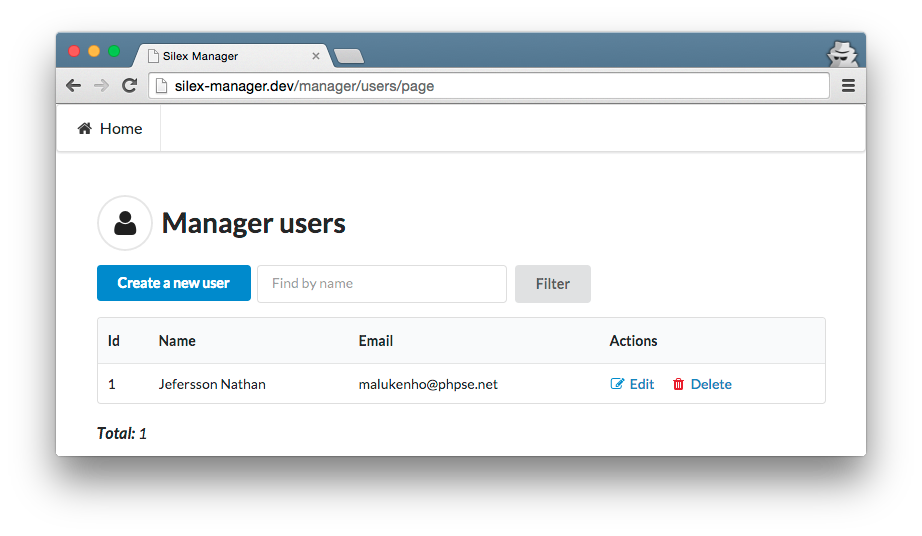

Silex Manager
=============

[](https://travis-ci.org/malukenho/silex-manager)

Silex Manager is a easy way to create crap CRUD based application.
We know that CRUD based apps is so bad, but It's needed some times.

**Now you can create crap application in minutes**



## Author

- [Jefersson Nathan](https://github.com/malukenho)

## Installing

You have to set the `minimum-stability` to `dev` and then run:

```
$ composer require malukenho/silex-manager
```

## Requirements

- twig/twig
- symfony/twig-bridge
- symfony/session
- symfony/form
- symfony/security-csrf
- symfony/translation

## Usage

First of all, you need to register the `ManagerControllerProvider` to your `Silex\Application`.
For now you should pass a `PDO` instance to the our provider.

```php
$adapter = new \Manager\Db\Adapter\PdoAdapter($pdo);
$app->mount('/manager', new \Manager\Controller\ManagerControllerProvider($adapter));
```

When you install the `Silex Manager`, you don't need to install Silex, because it's already installed.
And all dependencies is installed too. You just want to config this dependencies properly.

```php
$app->register(new Provider\TwigServiceProvider(), [
    // Use this path to load the default views (It's use semantic-ui from CDN)
    'twig.path' => __DIR__ . '/vendor/malukenho/silex-manager/views',
]);

$app->register(new Provider\UrlGeneratorServiceProvider());
$app->register(new Provider\SessionServiceProvider());
$app->register(new Provider\ServiceControllerServiceProvider());
$app->register(new Provider\FormServiceProvider());
$app->register(new Provider\ValidatorServiceProvider());
$app->register(new Provider\TranslationServiceProvider(), [
    'translator.domains' => [],
]);

```

## Routes

| Router                        |       Bind     |
|-------------------------------|----------------|
| /{dbTable}/page/{pageNumber}  | manager-index  |
| /{dbTable}/new                | manager-new    |
| /{dbTable}/edit/{id}          | manager-edit   |
| /{dbTable}/delete/{id}        | manager-delete |

### Configurations

You have to put some configuration on `$app['manager-config']` to make use
of power from Silex Manager.

Bellow you can see an example how to make a basic configuration.
Note that `users` refers to the name of table, and this is including a file
to configure the interface/callbacks/fields.

```php
$app['manager-config'] = [
    // Inside the `manager` key we have config for tables
    'manager' => [
        'users' => require __DIR__ . '/config/users.php',
    ],
    // Configuration pointing to default view
    // You can use your own views
    'view'    => [
        'index' => 'manager-index.twig',
        'new'   => 'manager-new.twig',
        'edit'  => 'manager-edit.twig',
    ],
];
```

Let's look at the `index` action on `/config/users.php` config definition file.

```php
return [

    // List action
    'index' => [
        // Define columns
        // column name on db => label
        'columns' => [
            'id'    => 'Id',
            'name'  => 'Name',
            'email' => 'Email',
        ],
        // UI page header
        'header' => 'Manager users',
         // UI page icon
        'icon'   => 'user',
        // Allow pagination
        'pagination' => true,
        // Show items per page
        'item_per_page' => 10,
        // Actions allowed
        'action' => [
            'new' => 'Create a new user',
            'edit' => 'Edit',
            'delete' => 'Delete',
        ],
        // Configuration for search field
        'search' => [
            'input' =>[
                [
                    'name' => 'name',
                    'placeholder' => 'Find by name',
                ],
            ],
            'button' => 'Filter'
        ],
    ],
];
```

### Custom queries

Sometimes you will need make a custom query to show data on the list page.
This is possible by setting the key `query`.

```php
$app['manager-config'] = [
    'manager' => [
        'users' => [
            'index' => [
                'query' => 'SELECT * FROM users u INNER JOIN user_admin ua ON u.id = ua.id',
            ],
        ],
    ],
];
```

### Actions

Missing documentation

### Views

Missing documentation

### Columns

Missing documentation

### Before

Missing documentation

### After

Missing documentation

### Custom names

Missing documentation

### Modifiers

Missing documentation

